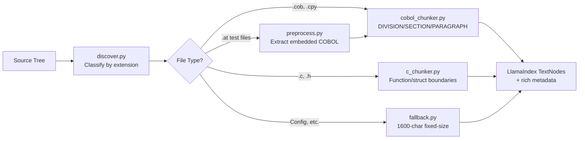

# Building a RAG System for Legacy Code: A Step-by-Step Guide

How we built COBOLedu — a natural language search engine for the GnuCOBOL compiler codebase — and how you can build your own for any legacy codebase.

---

## What You'll Build

A deployed RAG (Retrieval-Augmented Generation) system that lets you ask natural language questions about a legacy codebase and get answers citing specific file paths and line numbers. The system includes:

- Syntax-aware chunking for COBOL and C source code
- Multi-pass retrieval with cross-encoder reranking
- Streaming answers via SSE with Claude Sonnet 4
- Five specialized code understanding features (explain, dependencies, patterns, docs, business logic)
- Observability and evaluation via Langfuse
- A web UI with syntax highlighting, file drill-down, and copy functionality

**Target codebase:** [GnuCOBOL](https://github.com/OCamlPro/gnucobol) — an open-source COBOL compiler written in C, with COBOL test programs embedded in autotest files. You can adapt this approach to any legacy codebase.

**Final stack:**

```
Voyage Code 3 (embeddings) + Voyage rerank-2.5 (reranking)
  → Pinecone Serverless (vector DB)
  → LlamaIndex (orchestration)
  → Claude Sonnet 4 (generation, via direct Anthropic SDK)
  → Langfuse (observability + evaluation)
  → FastAPI + single-file HTML/JS frontend
  → Railway (deployment)
```

---

## Prerequisites

- **Python 3.12+**
- **API keys** (all have free tiers sufficient for this project):

| Service | Free Tier | Sign Up |
|---|---|---|
| Voyage AI | 200M tokens | [dash.voyageai.com](https://dash.voyageai.com/) |
| Pinecone | 2GB storage, 1M reads/mo | [app.pinecone.io](https://app.pinecone.io/) |
| Anthropic | Pay-per-use (~$1-5 for dev) | [console.anthropic.com](https://console.anthropic.com/) |
| Langfuse | 50K observations/mo | [us.cloud.langfuse.com](https://us.cloud.langfuse.com/) |
| Railway | $5/mo (deployment) | [railway.com](https://railway.com/) |

Total API cost for development: **~$6** (Anthropic LLM calls dominate; embeddings, reranking, and vector DB stay within free tiers).

---

## Phase 0: Project Setup

### Initialize the repository

```bash
mkdir coboledu && cd coboledu
git init
python3.12 -m venv venv
source venv/bin/activate  # Windows: venv\Scripts\activate
```

### Install dependencies

```bash
pip install llama-index llama-index-vector-stores-pinecone llama-index-embeddings-voyageai
pip install llama-index-llms-anthropic
pip install pinecone-client voyageai
pip install fastapi uvicorn python-dotenv
pip install anthropic
pip install langfuse openinference-instrumentation-llama-index
pip install cachetools
```

What each group does:
- **llama-index + integrations** — orchestration, node schema, vector store abstraction
- **pinecone-client + voyageai** — vector DB and embedding/reranking APIs
- **fastapi + uvicorn** — web server
- **anthropic** — direct Claude API for streaming (bypasses LlamaIndex for generation)
- **langfuse + openinference** — observability with auto-instrumentation
- **cachetools** — TTL-based response caching

### Configure environment variables

Create `.env` at the project root:

```bash
VOYAGE_API_KEY=your-voyage-api-key
PINECONE_API_KEY=your-pinecone-api-key
PINECONE_INDEX_NAME=coboledu
PINECONE_HOST=                          # optional, alternative to index name
ANTHROPIC_API_KEY=your-anthropic-api-key
LANGFUSE_SECRET_KEY=sk-lf-...
LANGFUSE_PUBLIC_KEY=pk-lf-...
LANGFUSE_BASE_URL=https://us.cloud.langfuse.com
```

Create `.gitignore`:

```
.env
venv/
__pycache__/
*.pyc
.DS_Store
gnucobol-source/
```

### Clone the target codebase

```bash
git clone https://github.com/OCamlPro/gnucobol.git gnucobol-source
```

Key directories you'll be indexing:
- `cobc/` — the COBOL compiler itself (C source). Core files: `cobc.c`, `parser.y`, `scanner.l`, `codegen.c`
- `libcob/` — the runtime library (C source). Core files: `common.c`, `move.c`, `numeric.c`, `fileio.c`
- `tests/testsuite.src/` — COBOL test programs embedded inside `.at` autotest files (the richest source of COBOL code)
- `config/` — dialect configuration files

### Create project structure

```bash
mkdir -p src/{ingestion,chunking,retrieval,api/static}
mkdir -p scripts
touch src/__init__.py src/ingestion/__init__.py src/chunking/__init__.py
touch src/retrieval/__init__.py src/api/__init__.py
```

### Configuration module (`src/config.py`)

```python
from pathlib import Path
from dotenv import load_dotenv
import os

load_dotenv()

PROJECT_ROOT = Path(__file__).resolve().parent.parent
GNUCOBOL_SOURCE_DIR = PROJECT_ROOT / "gnucobol-source"

VOYAGE_API_KEY = os.getenv("VOYAGE_API_KEY")
PINECONE_API_KEY = os.getenv("PINECONE_API_KEY")
PINECONE_INDEX_NAME = os.getenv("PINECONE_INDEX_NAME", "coboledu")
PINECONE_HOST = os.getenv("PINECONE_HOST")
ANTHROPIC_API_KEY = os.getenv("ANTHROPIC_API_KEY")

EMBEDDING_MODEL = "voyage-code-3"
EMBEDDING_DIMENSION = 1024
TOP_K = 5
RETRIEVAL_K = 20          # over-retrieve, then rerank down to TOP_K
RERANK_MODEL = "rerank-2.5"
CHUNK_SIZE = 400           # target tokens per chunk
CHUNK_OVERLAP = 50
```

`RETRIEVAL_K = 20` and `TOP_K = 5` are the key retrieval parameters: fetch 20 candidates from Pinecone, rerank to the best 5. This over-retrieve-then-rerank pattern was the single biggest precision improvement.

---

## Phase 1: File Discovery & Preprocessing

### File discovery (`src/ingestion/discover.py`)

Build a module that recursively scans the target codebase and classifies files:

```python
from dataclasses import dataclass

@dataclass
class FileInfo:
    path: str
    relative_path: str
    language: str        # "C", "COBOL", "COBOL_TEST", "YACC", "LEX", "CONFIG"
    extension: str
    size_bytes: int
    line_count: int
```

Language detection by extension:
- `.c`, `.h` → `"C"`
- `.cob`, `.cbl`, `.cpy` → `"COBOL"`
- `.at` → `"COBOL_TEST"` (these contain embedded COBOL programs)
- `.y` → `"YACC"`, `.l` → `"LEX"`
- `.conf`, `.words` → `"CONFIG"`

Skip directories: `_build`, `autom4te.cache`, `.git`. Skip extensions: `.o`, `.lo`, `.la`, `.pdf`, `.png`.

### Extracting COBOL from .at test files (`src/ingestion/preprocess.py`)

GnuCOBOL's test suite embeds COBOL programs inside m4 autotest macros:

```
AT_DATA([prog.cob], [
       IDENTIFICATION DIVISION.
       PROGRAM-ID. prog.
       PROCEDURE DIVISION.
           DISPLAY "Hello"
           STOP RUN.
])
```

**Use bracket-depth tracking, not naive regex.** COBOL source can contain `[` and `]` characters, so a regex like `AT_DATA\([^)]+\)` will break. Instead, track nesting depth to find the correct closing `])`:

```python
@dataclass
class ExtractedProgram:
    source_file: str
    program_name: str
    cobol_source: str
    line_offset: int
    extension: str

def extract_cobol_from_at(file_path: str) -> list[ExtractedProgram]:
    # Find AT_DATA([filename], [
    # Track bracket depth to find matching ])
    # Return extracted programs with source provenance
    ...
```

This is non-trivial and was one of the trickier parts of the build. The `.at` files are the richest source of COBOL code in the project — without proper extraction, you lose most of your COBOL training data.

### Encoding normalization

Also in `preprocess.py`:
- Detect encoding (UTF-8 or ASCII)
- Normalize line endings to `\n`
- Strip trailing whitespace
- Preserve COBOL column structure (columns 1-6: sequence, column 7: indicator, columns 8-72: code area)

---

## Phase 2: Chunking Engine

The chunking strategy is the foundation of retrieval quality. Naive fixed-size splitting destroys the semantic coherence that makes retrieval work. Each language gets its own chunker.



### COBOL chunker (`src/chunking/cobol_chunker.py`)

COBOL has an unusually clear hierarchy: DIVISION > SECTION > PARAGRAPH.

```python
from llama_index.core.schema import TextNode

def chunk_cobol(source: str, file_path: str, line_offset: int = 0) -> list[TextNode]:
    # 1. Detect DIVISION boundaries
    # 2. In PROCEDURE DIVISION: split at paragraph boundaries
    #    - Paragraph = identifier in Area A (cols 8-11) followed by period
    #    - Exclude 50+ known COBOL verbs (MOVE, PERFORM, DISPLAY, etc.)
    # 3. In DATA DIVISION: split at 01-level group items
    # 4. IDENTIFICATION/ENVIRONMENT: keep as single chunks
    ...
```

Each `TextNode` carries metadata:
```python
TextNode(
    text=chunk_text,
    metadata={
        "file_path": file_path,
        "line_start": start,
        "line_end": end,
        "language": "COBOL",
        "chunk_type": "paragraph",  # or section/division/data_item
        "division_name": "PROCEDURE",
        "section_name": section,
        "paragraph_name": para_name,
    },
    id_=unique_id,
)
```

This metadata is stored in Pinecone alongside the vector, enabling filtered retrieval later.

### C chunker (`src/chunking/c_chunker.py`)

```python
def chunk_c_file(source: str, file_path: str) -> list[TextNode]:
    # 1. Detect function definitions via regex + brace matching
    # 2. Include preceding comment block with each function
    # 3. Sub-chunk functions > 2000 chars with 200-char overlap
    # 4. Headers: chunk struct/enum/typedef individually
    # 5. Capture file preamble (includes before first function)
    ...
```

Brace matching must handle strings, comments, and nested braces. Some functions in `cobc/codegen.c` exceed 1000 lines — the sub-chunking with overlap is essential.

### Fallback chunker (`src/chunking/fallback.py`)

For config files, Makefiles, and anything else:
- 1600 characters (~400 tokens) per chunk
- 200-character overlap
- Split at line boundaries

### Orchestrator (`src/chunking/orchestrator.py`)

Routes files to the correct chunker based on `FileInfo.language`, collects all `TextNode` objects, and logs statistics.

---

## Phase 3: Embedding & Vector Storage

### Create the Pinecone index (`scripts/create_index.py`)

```python
from pinecone import Pinecone, ServerlessSpec
import os
from dotenv import load_dotenv

load_dotenv()
pc = Pinecone(api_key=os.getenv("PINECONE_API_KEY"))
pc.create_index(
    name="coboledu",
    dimension=1024,          # must match Voyage Code 3 output
    metric="cosine",
    spec=ServerlessSpec(cloud="aws", region="us-east-1"),
)
```

Run once: `python -m scripts.create_index`

### Embedding wrapper with caching (`src/retrieval/embeddings.py`)

```python
from llama_index.embeddings.voyageai import VoyageEmbedding
from functools import lru_cache

class CachedVoyageEmbedding(VoyageEmbedding):
    """Adds LRU cache on query embeddings to avoid redundant API calls."""

    @lru_cache(maxsize=512)
    def _get_query_embedding(self, query: str) -> list[float]:
        return super()._get_query_embedding(query)

def get_embed_model():
    return CachedVoyageEmbedding(
        model_name="voyage-code-3",
        voyage_api_key=os.getenv("VOYAGE_API_KEY"),
        output_dimension=1024,
        truncation=True,
        embed_batch_size=128,
    )
```

**Why Voyage Code 3:** It outperforms OpenAI's text-embedding-3-large by 13.8% on code retrieval benchmarks. The 32K token context window handles large COBOL paragraphs and C functions that would be truncated by OpenAI's 8K limit. The free tier (200M tokens) covers the entire development cycle.

**The COBOL challenge:** No embedding model has been trained on COBOL. In practice, Voyage Code 3 handles it well because it understands structural patterns (function boundaries, variable declarations, control flow) even in unfamiliar languages. COBOL's English-like keywords (MOVE, PERFORM, DISPLAY) may actually help since the model picks up semantic similarity through natural language.

### Vector store connection (`src/retrieval/vector_store.py`)

```python
from llama_index.vector_stores.pinecone import PineconeVectorStore
from llama_index.core import VectorStoreIndex, StorageContext
from pinecone import Pinecone

def get_vector_store():
    pc = Pinecone(api_key=os.getenv("PINECONE_API_KEY"))
    if os.getenv("PINECONE_HOST"):
        pinecone_index = pc.Index(host=os.getenv("PINECONE_HOST"))
    else:
        pinecone_index = pc.Index(os.getenv("PINECONE_INDEX_NAME"))
    return PineconeVectorStore(pinecone_index=pinecone_index)

def get_index(vector_store):
    storage_context = StorageContext.from_defaults(vector_store=vector_store)
    return VectorStoreIndex.from_vector_store(vector_store, storage_context=storage_context)
```

### Ingestion pipeline (`src/ingestion/ingest.py`)

Ties Phases 1-3 together:

```python
def ingest():
    # 1. Discover files
    files = discover_files(str(GNUCOBOL_SOURCE_DIR))

    # 2. Extract COBOL from .at files
    extracted = []
    for f in files:
        if f.language == "COBOL_TEST":
            extracted.extend(extract_cobol_from_at(f.path))

    # 3. Chunk everything
    chunks = chunk_all_files(files, extracted)

    # 4. Embed and upsert (LlamaIndex handles this automatically)
    Settings.embed_model = get_embed_model()
    vector_store = get_vector_store()
    storage_context = StorageContext.from_defaults(vector_store=vector_store)
    index = VectorStoreIndex(
        nodes=chunks,
        storage_context=storage_context,
        show_progress=True,
    )
```

Use exponential backoff for Voyage rate limits during batch embedding. The full GnuCOBOL codebase produces ~3,000-5,000 vectors.

```bash
python -m src.ingestion.ingest
```

---

## Phase 4: Query & Answer Generation

This is where COBOLedu diverges from a typical LlamaIndex tutorial. A naive implementation would be:

```python
engine = index.as_query_engine(similarity_top_k=5)
response = engine.query("Where is the main entry point?")
```

That gives you ~54% precision. To reach 71%, we needed multi-pass retrieval, reranking, and to bypass LlamaIndex for generation.

### Query preprocessing (`src/retrieval/query.py`)

Expand user queries with domain-specific synonyms:

```python
_COBOL_EXPANSIONS = [
    (re.compile(r"file\s+i/?o", re.I), "READ WRITE OPEN CLOSE FILE fileio.c"),
    (re.compile(r"entry\s+point", re.I), "main argc argv cobc.c"),
    (re.compile(r"\bparser\b", re.I), "parser.y cobc YACC grammar syntax rule"),
    (re.compile(r"\bdata\s+type", re.I), "PIC PICTURE field type tree.c field.c"),
    # ... 19 patterns total
]

def preprocess_query(question: str) -> str:
    extras = []
    for pattern, expansion in _COBOL_EXPANSIONS:
        if pattern.search(question):
            extras.append(expansion)
    # Decompose COBOL identifiers: CUSTOMER-RECORD → CUSTOMER RECORD CUSTOMER-RECORD
    for cid in extract_cobol_identifiers(question):
        parts = cid.split("-")
        if len(parts) >= 2:
            extras.append(f"{cid} {' '.join(parts)}")
    return f"{question} {' '.join(extras)}" if extras else question
```

The identifier decomposition was a late addition that moved precision from 67% to 70%+. COBOL uses hyphenated names like `CUSTOMER-RECORD` and `CALCULATE-INTEREST` — the embedding model doesn't naturally associate `CUSTOMER-RECORD` with `CUSTOMER` and `RECORD` as separate concepts.

### Multi-pass retrieval

Instead of a single Pinecone query, execute up to 4 passes and deduplicate:

```python
def _merged_retrieve(index, expanded_query, language, file_hints, cobol_ids):
    # Pass 1: Primary — top-20 dense similarity
    primary = index.as_retriever(similarity_top_k=RETRIEVAL_K)
    nodes = primary.retrieve(expanded_query)
    seen_ids = {n.node_id for n in nodes}

    # Pass 2: Language-filtered — top-10 from detected language
    if language:  # "COBOL" or "C"
        filters = MetadataFilters(
            filters=[ExactMatchFilter(key="language", value=language)]
        )
        secondary = index.as_retriever(similarity_top_k=10, filters=filters)
        for n in secondary.retrieve(expanded_query):
            if n.node_id not in seen_ids:
                nodes.append(n)
                seen_ids.add(n.node_id)

    # Pass 3: File-hint — top-5 per filename mentioned in expansion
    for hint in (file_hints or [])[:3]:
        for n in index.as_retriever(similarity_top_k=5).retrieve(f"implementation in {hint}"):
            if n.node_id not in seen_ids:
                nodes.append(n)
                seen_ids.add(n.node_id)

    # Pass 4: Identifier — top-5 per COBOL identifier
    for cid in (cobol_ids or [])[:2]:
        parts = cid.split("-")
        id_query = f"{cid} {' '.join(parts)} COBOL paragraph section"
        for n in index.as_retriever(similarity_top_k=5).retrieve(id_query):
            if n.node_id not in seen_ids:
                nodes.append(n)
                seen_ids.add(n.node_id)

    return nodes
```

A language detection heuristic classifies queries as COBOL-targeted, C-targeted, or mixed based on keyword signals, routing the secondary pass appropriately.

### Reranking with file diversity

Voyage rerank-2.5 cross-encoder re-scores all candidates. File diversity enforcement (max 3 chunks per file) prevents large files from monopolizing results:

```python
import voyageai

def rerank_nodes(question, nodes, top_k=5, max_per_file=3):
    vo = voyageai.Client()
    docs = [n.get_content() for n in nodes]
    reranked = vo.rerank(question, docs, model="rerank-2.5", top_k=top_k * 3)

    result, file_counts = [], {}
    for r in reranked.results:
        node = nodes[r.index]
        fp = node.metadata.get("file_path", "unknown")
        if file_counts.get(fp, 0) < max_per_file:
            node.score = r.relevance_score
            result.append(node)
            file_counts[fp] = file_counts.get(fp, 0) + 1
            if len(result) >= top_k:
                break
    return result
```

Without file diversity, `cobc/codegen.c` (the code generator, with many functions) consumed all 5 result slots for most queries.

### Bypassing LlamaIndex for generation

LlamaIndex's `engine.query()` blocks until the full response is generated. For streaming, we call the Anthropic API directly:

```python
import anthropic

_CACHED_SYSTEM_BLOCK = [{
    "type": "text",
    "text": CODE_QA_SYSTEM,
    "cache_control": {"type": "ephemeral"},
}]

async def stream_query(engine, question):
    # 1. Retrieve and rerank (reuse LlamaIndex for retrieval only)
    index = engine._retriever._index
    expanded = preprocess_query(question)
    nodes = _merged_retrieve(index, expanded, ...)
    nodes = rerank_nodes(expanded, nodes, top_k=TOP_K)
    sources = _extract_sources(nodes)

    # 2. Build prompt manually
    context_str = "\n\n".join(node.get_content() for node in nodes)
    user_msg = f"Retrieved code:\n{context_str}\n\nQuestion: {question}\n\nAnswer:"

    # 3. Stream directly from Anthropic SDK
    client = anthropic.AsyncAnthropic(api_key=ANTHROPIC_API_KEY)
    async with client.messages.stream(
        model="claude-sonnet-4-20250514",
        max_tokens=4096,
        system=_CACHED_SYSTEM_BLOCK,
        messages=[{"role": "user", "content": user_msg}],
    ) as stream:
        async for text in stream.text_stream:
            yield ("token", text)
    yield ("sources", sources)
```

The `cache_control: {"type": "ephemeral"}` on the system message enables Anthropic's prompt caching — since the system prompt is identical for every query, subsequent calls within the TTL get ~90% cost reduction on the cached prefix.

### Three caching layers

```python
from cachetools import TTLCache

# 1. Anthropic prompt caching (automatic via cache_control: ephemeral)
# 2. Response cache for identical queries
_query_cache = TTLCache(maxsize=256, ttl=3600)

def query(engine, question):
    if question in _query_cache:
        return _query_cache[question]
    result = _do_query(engine, question)
    _query_cache[question] = result
    return result

# 3. Embedding cache (CachedVoyageEmbedding with LRU, see Phase 3)
```

---

## Phase 5: Web Interface

### FastAPI server (`src/api/main.py`)

```python
from fastapi import FastAPI, APIRouter
from starlette.responses import StreamingResponse

app = FastAPI(title="COBOLedu", lifespan=lifespan)
api = APIRouter(prefix="/api")

@api.post("/query/stream")
async def query_stream_endpoint(req: QueryRequest):
    async def event_generator():
        async for event_type, data in stream_query(engine, req.question):
            if event_type == "token":
                yield f"event: token\ndata: {json.dumps(data)}\n\n"
            elif event_type == "sources":
                yield f"event: sources\ndata: {json.dumps([asdict(s) for s in data])}\n\n"
        yield "event: done\ndata: \n\n"
    return StreamingResponse(event_generator(), media_type="text/event-stream")

app.include_router(api)
app.mount("/", StaticFiles(directory="src/api/static", html=True))
```

The query engine initializes once on startup via `lifespan`, not per-request. Static files are mounted last so `/api/*` routes take priority.

### Frontend (`src/api/static/index.html`)

Single-file HTML/CSS/JS app. Key features:

**Mode tabs** — Search, Explain, Dependencies, Patterns, Docs, Business Logic. Each tab routes to the corresponding API endpoint.

**SSE streaming** — Uses `fetch` + `ReadableStream` to consume server-sent events:

```javascript
const res = await fetch("/api/query/stream", {
    method: "POST",
    headers: { "Content-Type": "application/json" },
    body: JSON.stringify({ question })
});
const reader = res.body.getReader();
const decoder = new TextDecoder();
// Parse SSE: split on \n\n, extract event: and data: lines
// On "token" events: append to accumulated text, re-render markdown
// On "sources" events: build source cards
```

**Status phases** — Before tokens arrive, cycle through "Searching codebase..." → "Reading source files..." → "Generating answer..." with timed transitions. Clear on first token.

**Syntax highlighting** — Prism.js via CDN with C and COBOL language grammars. Applied to source card previews and code blocks in LLM answers.

**File drill-down** — "Expand" button fetches `GET /api/file?path=...&line_start=N&line_end=N` for +/- 50 lines of surrounding context, with line numbers and the original range highlighted.

**Copy buttons** — On source cards, the full answer, and individual code blocks. Uses `navigator.clipboard.writeText()` with "Copied!" tooltip feedback.

**Example query chips** — 4 clickable queries below the search box to demonstrate capabilities.

### File drill-down endpoint

```python
SOURCE_ROOT = Path(__file__).resolve().parent.parent.parent / "gnucobol-source"

@api.get("/file")
async def file_endpoint(path: str, line_start: int = 0, line_end: int = 0):
    if ".." in path or path.startswith("/"):
        raise HTTPException(400, "Invalid path")
    file_path = (SOURCE_ROOT / path).resolve()
    if not file_path.is_relative_to(SOURCE_ROOT.resolve()):
        raise HTTPException(400, "Invalid path")
    # Return content window with +/- 50 lines of context
```

Path-traversal guard rejects `..` segments and absolute paths.

---

## Phase 6: Observability & Evaluation

### Langfuse via OpenInference (`src/observability.py`)

```python
from langfuse import get_client, observe
from openinference.instrumentation.llama_index import LlamaIndexInstrumentor

def init_observability():
    LlamaIndexInstrumentor().instrument()
    client = get_client()
    if client.auth_check():
        logger.info("Langfuse tracing active")

langfuse_client = get_client()
```

`LlamaIndexInstrumentor().instrument()` auto-instruments all LlamaIndex operations — embedding calls, retrieval operations, everything. No callback manager needed. Individual functions are decorated with `@observe()` for named trace spans:

```python
@observe(name="coboledu-query")
def query(engine, question):
    ...

@observe(name="coboledu-stream-query")
async def stream_query(engine, question):
    ...
```

Flush after every request:
```python
# In FastAPI endpoints
try:
    result = query(engine, req.question)
except Exception:
    ...
finally:
    langfuse_client.flush()
```

### Evaluation dataset (`scripts/create_eval_dataset.py`)

Upload 20+ test items to Langfuse covering diverse query categories:

```python
eval_items = [
    {"input": {"query": "Where is the main entry point of the compiler?"},
     "expected_output": {"expected_files": ["cobc/cobc.c"], "expected_terms": ["main", "argc", "argv"]}},
    {"input": {"query": "How does GnuCOBOL handle PERFORM statements?"},
     "expected_output": {"expected_files": ["cobc/codegen.c", "cobc/parser.y"], "expected_terms": ["perform"]}},
    {"input": {"query": "Find all file I/O operations in the test programs"},
     "expected_output": {"expected_files": ["tests/"], "expected_terms": ["READ", "WRITE", "OPEN"]}},
    # ... 17 more items
]
```

Categories to cover: compiler entry points, runtime library, COBOL test programs, data type handling, error handling, file I/O, configuration, string operations, numeric operations, parser/scanner.

### Running experiments (`scripts/run_eval.py`)

```bash
python -m scripts.create_eval_dataset    # one-time: uploads items to Langfuse
python -m scripts.run_eval --name baseline-v1
```

Each run produces precision@5 (what fraction of top-5 results come from expected files) and term_coverage (what fraction of expected terms appear in the answer). Langfuse's experiment dashboard shows side-by-side comparison across runs.

### Local diagnostic (`scripts/eval_diagnostic.py`)

```bash
python -m scripts.eval_diagnostic                   # full pipeline
python -m scripts.eval_diagnostic --retrieval-only   # skip LLM, just check files
```

Prints per-item precision breakdown to identify exactly which queries underperform, without needing Langfuse.

---

## Phase 7: The Optimization Journey (54% → 71%)

This section is the most valuable part of this guide. Most RAG tutorials stop at "plug in a vector DB and you're done." In practice, getting from a working prototype to good retrieval quality requires systematic iteration.

### Baseline: 54% precision@5

The naive setup — Voyage Code 3 embeddings, Pinecone top-5, LlamaIndex query engine — gives you ~54% precision. That means roughly half the time, the top-5 results don't include the files you'd expect.

### Intervention 1: Reranking (+5-10%)

Over-retrieve 20 candidates from Pinecone, then use Voyage rerank-2.5 (a cross-encoder) to re-score them against the actual query text and pick the top 5. Cross-encoders are much more accurate than bi-encoder similarity but too expensive to run on the full index.

```
Pinecone (bi-encoder, fast, approximate) → top-20 candidates
Voyage rerank-2.5 (cross-encoder, accurate, slow) → top-5 final
```

### Intervention 2: Query expansion (+10-15%)

Dense embeddings work great for semantic similarity but miss keyword matches. A query about "file I/O" won't embed close to code containing `READ`, `WRITE`, `OPEN`, `CLOSE`. The 19 regex-based expansion patterns bridge this gap by appending domain-specific keywords.

### Intervention 3: Multi-pass retrieval (+5%)

A single retrieval pass sometimes misses relevant results because:
- COBOL results get diluted by C results (or vice versa)
- Files mentioned in the expansion aren't retrieved because the full expanded query is semantically distant

The language-filtered, file-hint, and identifier passes each target a specific gap. Deduplication by node ID ensures no duplicates.

### Intervention 4: File diversity (stabilizer)

Without diversity enforcement, `cobc/codegen.c` (the largest file, with many functions) consumed all 5 result slots for most compiler-related queries. Capping at 3 chunks per file forces results to span multiple files.

### Intervention 5: Identifier decomposition (+3%)

COBOL uses hyphenated names: `CUSTOMER-RECORD`, `CALCULATE-INTEREST`. The embedding model doesn't naturally associate `CUSTOMER-RECORD` with `CUSTOMER` and `RECORD` separately. Decomposing identifiers into parts improved retrieval for queries referencing specific data items.

### What we didn't need

**BM25 hybrid search** was planned as a fallback if the above interventions weren't enough. It would have required a full re-index with sparse vectors. The combination of reranking + expansion + multi-pass + diversity was sufficient to hit 70%+, so BM25 was cancelled.

### Measurement discipline

Every intervention got its own eval run. Name them descriptively:

```
baseline-v1            → 54%
rerank-v1              → 59%
rerank-expand-v1       → 74%
full-pipeline-v1       → 66% (regression from over-expansion)
tuned-pipeline-v1      → 70%
final-v1               → 71%
```

Some interventions caused regressions (query expansion initially hurt term coverage by adding noise). The eval pipeline caught this immediately, allowing targeted fixes.

### Final performance

| Metric | Baseline | Final | Target |
|---|---|---|---|
| Precision@5 | 54% | **71%** | >70% |
| Term coverage | — | **93.8%** | — |
| Codebase coverage | 100% | 100% | 100% |
| Avg cost per query | — | **$0.0175** | — |

---

## Phase 8: Code Understanding Features

Five specialized features beyond basic search, all reusing the same retrieval + reranking pipeline with feature-specific system prompts.

### Architecture

```python
# Shared helpers in src/retrieval/features.py

def _retrieve(query, top_k=5):
    """Multi-pass retrieval + reranking (same as search)."""
    ...

def _llm_generate(system, user):
    """Sync Claude call with prompt caching."""
    client = anthropic.Anthropic(api_key=ANTHROPIC_API_KEY)
    resp = client.messages.create(
        model="claude-sonnet-4-20250514",
        system=[{"type": "text", "text": system, "cache_control": {"type": "ephemeral"}}],
        messages=[{"role": "user", "content": user}],
    )
    return resp.content[0].text

async def _llm_stream(system, user):
    """Async streaming Claude call with prompt caching."""
    client = anthropic.AsyncAnthropic(api_key=ANTHROPIC_API_KEY)
    async with client.messages.stream(...) as stream:
        async for text in stream.text_stream:
            yield text
```

### The five features

**1. Code Explanation** — Retrieve relevant chunks, generate structured breakdown with Purpose, Inputs/Outputs, Key Logic, Side Effects, Complexity Notes.

**2. Dependency Mapping** — Search for `PERFORM <name>` and `CALL <name>` patterns, generate caller/callee analysis. Post-process LLM output to extract structured caller/callee lists.

**3. Pattern Detection** — Pure semantic search (no LLM generation). Given a description like "error handling" or "file I/O", return the top-10 matching chunks directly.

**4. Documentation Generation** — Generate markdown docs for a function or COBOL paragraph: description, parameters, return value, usage examples, related functions.

**5. Business Logic Extraction** — Extract business rules from COBOL code: numbered rules with conditions/actions, data transformations, edge cases, plain English summary.

All features except Pattern Detection support both sync and SSE streaming endpoints. The FastAPI server uses a shared `_feature_event_generator()` wrapper for consistent SSE formatting across all streaming endpoints.

---

## Phase 9: Deployment

### Railway configuration

`Procfile`:
```
web: uvicorn src.api.main:app --host 0.0.0.0 --port $PORT
```

`runtime.txt`:
```
python-3.12.12
```

Set environment variables in the Railway dashboard (same as `.env`).

The `gnucobol-source/` directory must be included in the deployment for file drill-down to work. Remove it from `.gitignore` for deployment, or clone it as part of the build step.

### Freeze dependencies

```bash
pip freeze > requirements.txt
```

---

## Lessons Learned

### What worked well

- **Syntax-aware chunking** is non-negotiable. Naive fixed-size splitting gives you garbage retrieval. COBOL's DIVISION/SECTION/PARAGRAPH hierarchy made this straightforward once we got the regex right.
- **Over-retrieve + rerank** is the highest-leverage single improvement. Going from top-5 to top-20→rerank-to-top-5 was worth +5-10% precision with minimal latency impact.
- **Bracket-depth tracking for .at extraction** was worth the complexity. These files are the richest COBOL source and naive regex would have silently lost programs.
- **Langfuse experiment tracking** made iteration data-driven. Without per-run precision numbers, we would have been guessing at what helped.
- **Bypassing LlamaIndex for generation** gave us streaming and prompt caching. The framework is great for retrieval orchestration but its `engine.query()` blocks.

### What surprised us

- **File diversity enforcement** was more important than expected. One large file can dominate results without it.
- **COBOL identifier decomposition** was a late addition that had outsized impact. Hyphenated names are common in COBOL but alien to embedding models.
- **Query expansion can regress quality.** Over-expanding adds noise that the reranker has to filter out. Each expansion pattern needs validation via eval.
- **Embedding cache hit rate was 47%.** Much higher than expected — many queries share similar substructures.

### What we'd do differently

- **Start with the eval pipeline earlier.** We built the eval dataset in Phase 6 but should have done it in Phase 3, before the first retrieval experiment. Flying blind on quality for the first few phases meant wasted iteration.
- **Consider a lighter LLM for simple queries.** Claude Sonnet 4 at $0.0175/query is fine for development but model tiering (Haiku for "where is X?" queries, Sonnet for complex explanations) would cut production costs significantly.
- **Don't bother with LlamaIndex for generation.** We used it for the initial `RetrieverQueryEngine` setup but replaced it with direct Anthropic calls for streaming. If starting over, we'd use LlamaIndex purely for retrieval/embedding orchestration and go direct-to-API for generation from day one.

---

## Architecture Reference

For the full technical architecture with mermaid diagrams, see [RAG_ARCHITECTURE.md](RAG_ARCHITECTURE.md).

## Cost Reference

For detailed cost breakdown and production projections, see [COST_ANALYSIS.md](COST_ANALYSIS.md).

---

## Project Structure

```
COBOLedu/
├── .env                              # API keys (gitignored)
├── .gitignore
├── README.md
├── requirements.txt
├── Procfile                          # Railway deployment
├── runtime.txt                       # Python 3.12.12
├── gnucobol-source/                  # GnuCOBOL repo (gitignored)
├── docs/
│   ├── BUILD_GUIDE.md                # This file
│   ├── RAG_ARCHITECTURE.md           # Technical architecture
│   └── COST_ANALYSIS.md              # Cost analysis
├── src/
│   ├── config.py                     # Env vars and constants
│   ├── observability.py              # Langfuse + OpenInference setup
│   ├── cli.py                        # Interactive CLI
│   ├── ingestion/
│   │   ├── discover.py               # File discovery & filtering
│   │   ├── preprocess.py             # .at COBOL extraction
│   │   └── ingest.py                 # Full ingestion pipeline
│   ├── chunking/
│   │   ├── cobol_chunker.py          # COBOL paragraph-level splitting
│   │   ├── c_chunker.py              # C function-level splitting
│   │   ├── fallback.py               # Fixed-size fallback
│   │   └── orchestrator.py           # Routes to correct chunker
│   ├── retrieval/
│   │   ├── embeddings.py             # CachedVoyageEmbedding
│   │   ├── vector_store.py           # Pinecone connection
│   │   ├── query.py                  # Multi-pass retrieval + reranking + streaming
│   │   └── features.py              # 5 code understanding features
│   └── api/
│       ├── main.py                   # FastAPI (15 endpoints)
│       └── static/
│           └── index.html            # Web UI
└── scripts/
    ├── create_index.py               # One-time Pinecone setup
    ├── create_eval_dataset.py        # Upload eval items to Langfuse
    ├── run_eval.py                   # Run eval experiments
    └── eval_diagnostic.py            # Local precision diagnostic
```
