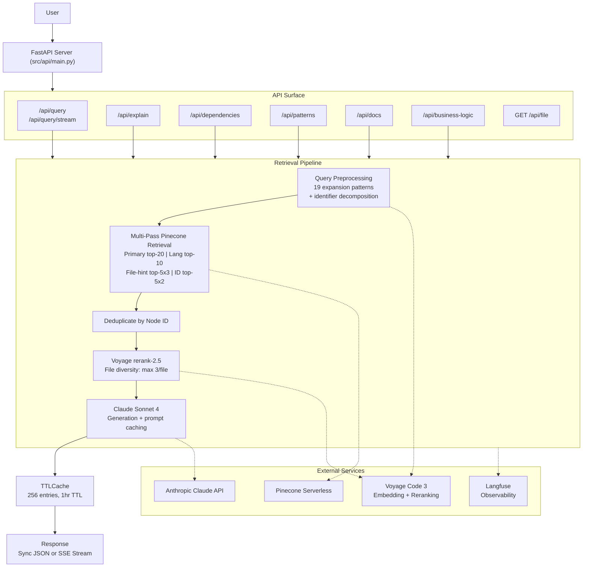
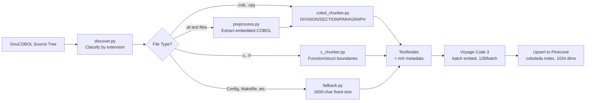
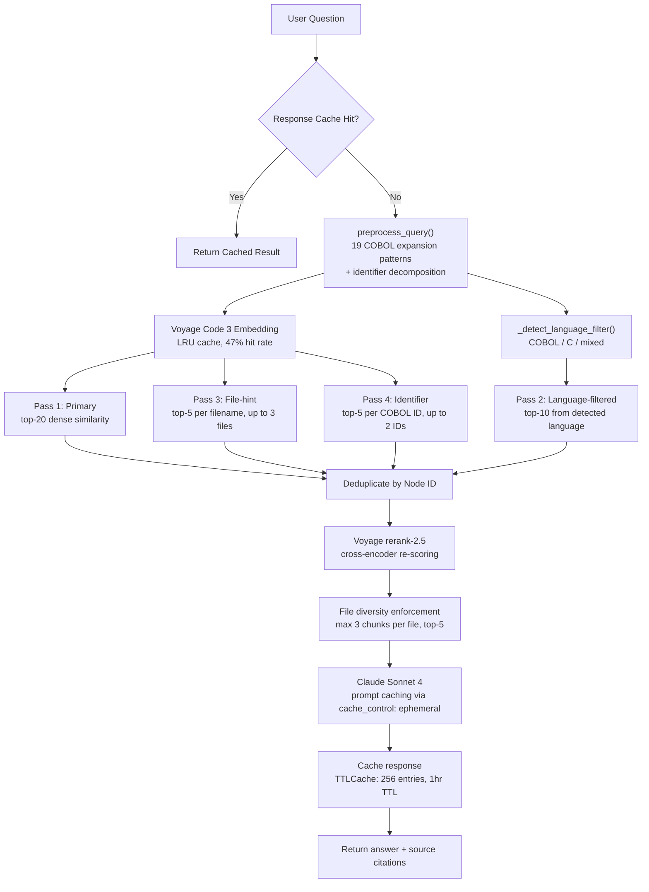

# COBOLedu — RAG Architecture Documentation

## System Overview

---

## 1. Vector Database Selection

**Choice:** Pinecone Serverless (Starter plan, AWS us-east-1)

**Why Pinecone:** The 24-hour MVP timeline made infrastructure complexity the biggest risk. Pinecone's fully managed serverless architecture eliminated all operational overhead — no provisioning, no cluster management, no index tuning. The Starter plan provides 2GB storage, 1M read units/month, and 2M write units/month at zero cost, which is vastly more than the ~5,000 vectors this codebase produces.

**Tradeoffs considered:**

- **ChromaDB** was the fastest option for local development (embedded, zero config), but would require hosting a persistent server for the deployed demo. Starting with ChromaDB and migrating later would have been wasted effort.
- **Qdrant** (Rust-powered, open source) offered better performance benchmarks at scale and richer filtering, but required self-hosting infrastructure. At our scale (~5K vectors), these advantages don't materialize.
- **pgvector** would have been convenient with an existing Postgres database, but adding one just for vector search introduces unnecessary complexity.

**Configuration:** Index named `coboledu`, 1024 dimensions, cosine similarity metric. Metadata filtering enabled for `language`, `file_path`, `chunk_type`, `division_name`, `function_name`, and `paragraph_name` fields. The connection supports both host-based (`PINECONE_HOST`) and name-based (`PINECONE_INDEX_NAME`) initialization for flexibility across environments. Index creation is handled by `scripts/create_index.py`; connection logic lives in `src/retrieval/vector_store.py`; all constants are defined in `src/config.py`.

---

## 2. Embedding Strategy

**Choice:** Voyage Code 3 (1024 dimensions, float precision) with LRU query cache

**Why Voyage Code 3:** It outperforms OpenAI's text-embedding-3-large by 13.80% on code retrieval benchmarks and CodeSage-large by 16.81% across 238 code retrieval datasets. The 32K token context window is critical — some COBOL paragraphs and C functions in the GnuCOBOL codebase exceed 8K tokens, which would be truncated by OpenAI's 8K context limit. The free tier (200M tokens) covered the entire development cycle including multiple re-ingestion passes.

**The COBOL challenge:** No embedding model has been trained on COBOL or Fortran. COBOL's verbose, English-like syntax (keywords like MOVE, PERFORM, DISPLAY, COMPUTE) is syntactically unique among programming languages. In practice, Voyage Code 3 handles it well because it understands structural patterns like function boundaries, variable declarations, and control flow — even in unfamiliar languages. The English-like nature of COBOL keywords may actually help, since the model picks up semantic similarity through the natural language it was trained on.

**Implementation details** (see `src/retrieval/embeddings.py`):

- `CachedVoyageEmbedding` extends the LlamaIndex `VoyageEmbedding` class with an LRU cache (maxsize=512) on query embeddings. Langfuse logged 1,045 embedding observations, with 487 (47%) served through the cached path.
- `input_type` is automatically set to `document` during ingestion and `query` during retrieval by the LlamaIndex integration.
- `truncation=True` as a safety net for unexpectedly large chunks.
- `embed_batch_size=128` for efficient batch processing during ingestion.
- Ingestion uses exponential backoff with retry logic (6 retries, 15s base delay) to handle Voyage rate limits during batch embedding of 512-chunk batches.

---

## 3. Chunking Approach

**Core principle:** Respect the natural boundaries of each language. Naive fixed-size splitting destroys the semantic coherence that makes retrieval work.

### COBOL Chunking (`src/chunking/cobol_chunker.py`)

COBOL has an unusually clear hierarchical structure: DIVISION → SECTION → PARAGRAPH. The chunker detects all three levels:

- **PROCEDURE DIVISION:** Split at paragraph and section boundaries. Each paragraph (COBOL's equivalent of a function) becomes one chunk, including all statements until the next paragraph label. Paragraph detection uses regex matching for identifiers in Area A (columns 8-11) followed by a period, excluding 50+ known COBOL verbs (MOVE, PERFORM, DISPLAY, etc.) to avoid false positives.
- **DATA DIVISION:** Split at 01-level group items. Each record definition (01 level with its subordinate 05/10/15 fields) becomes one chunk. The record name is extracted and stored as `paragraph_name` in metadata.
- **IDENTIFICATION and ENVIRONMENT divisions:** Kept as single chunks (typically short).
- **Embedded COBOL in .at files:** GnuCOBOL's test suite embeds COBOL programs inside m4 autotest macros (`AT_DATA([prog.cob], [...])`). A custom parser (`src/ingestion/preprocess.py`) uses bracket-depth tracking to correctly extract nested COBOL content, handling the common case where COBOL source itself contains `[` and `]` characters. Each extracted program is processed through the same COBOL chunker, with metadata tracking the source `.at` file, line offset, and file extension.

### C Chunking (`src/chunking/c_chunker.py`)

- **Functions:** Primary chunk boundary. Detected via regex matching function signatures followed by `{`, with brace-matching that handles strings, comments, and nested braces. Preceding comment blocks are included.
- **Large functions:** Functions exceeding 2000 characters are sub-chunked with 200-character overlap at line boundaries.
- **Headers:** Struct/enum/typedef definitions are chunked individually. Function prototypes are batched in groups of 3+.
- **Preamble:** File-level includes and declarations before the first function are captured as a separate chunk.

### Fallback (`src/chunking/fallback.py`)

Config files, Makefiles, and other non-C/non-COBOL files use fixed-size splitting at 1600 characters (~400 tokens) with 200-character overlap, split at line boundaries.

### Metadata

Every chunk carries: `file_path`, `line_start`, `line_end`, `language` (COBOL/C/YACC/LEX/CONFIG), `chunk_type` (paragraph/section/division/data_item/function/struct/prototype_group/generic), `division_name`, `section_name`, `paragraph_name` or `function_name`. This metadata enables filtered retrieval and powers the citation format in answers. File routing is handled by `src/chunking/orchestrator.py`; file discovery by `src/ingestion/discover.py`.

---

## 4. Retrieval Pipeline

### Query Flow

All retrieval logic is in `src/retrieval/query.py`.

### Query Preprocessing

The `preprocess_query()` function in `src/retrieval/query.py` expands user questions with COBOL/GnuCOBOL-specific synonyms. Nineteen regex patterns match common query intents and append relevant keywords:

- "file I/O" → appends `READ WRITE OPEN CLOSE FILE fileio.c`
- "entry point" → appends `main argc argv cobc.c`
- "parser" → appends `parser.y cobc YACC grammar syntax rule`
- COBOL identifiers like `CUSTOMER-RECORD` are decomposed into parts: `CUSTOMER-RECORD CUSTOMER RECORD`

A language detection heuristic (`_detect_language_filter`) classifies queries as COBOL-targeted, C-targeted, or mixed based on keyword signals, routing the secondary retrieval pass appropriately.

### Re-ranking

Voyage rerank-2.5 cross-encoder re-scores all candidate nodes from the multi-pass retrieval. File diversity is enforced post-rerank: a maximum of 3 chunks per file ensures results span multiple areas of the codebase rather than clustering in one large file (critical for files like `cobc/codegen.c` which has many chunks).

### Answer Generation

Claude Sonnet 4 receives a system prompt (cached via Anthropic's `cache_control: ephemeral`) instructing it to cite file paths and line numbers, explain code in plain English, and distinguish between C compiler source and COBOL test programs. Streaming uses `anthropic.AsyncAnthropic` with `client.messages.stream()` directly (not LlamaIndex's built-in streaming), giving fine-grained control over SSE token delivery. The `/api/query/stream` endpoint uses SSE (Server-Sent Events) for streaming responses. All API endpoints are defined in `src/api/main.py`; feature-specific retrieval and generation logic lives in `src/retrieval/features.py`.

### Code Understanding Features

Five specialized endpoints use the same retrieval pipeline with feature-specific system prompts:

| Feature | Endpoint | Streaming | System Prompt Focus |
|---|---|---|---|
| Code Explanation | `/api/explain` | `/api/explain/stream` | Purpose, I/O, key logic, side effects, complexity |
| Dependency Mapping | `/api/dependencies` | `/api/dependencies/stream` | Callers and callees via PERFORM/CALL analysis |
| Pattern Detection | `/api/patterns` | — (sync only) | Semantic search, returns matching chunks directly |
| Documentation Gen | `/api/docs` | `/api/docs/stream` | Markdown docs: description, params, return, usage, related |
| Business Logic | `/api/business-logic` | `/api/business-logic/stream` | Business rules, data transformations, edge cases, summary |
| File Drill-down | `GET /api/file` | — | Returns source file content with surrounding context for code navigation |

All features except Pattern Detection and File Drill-down support both synchronous and streaming (SSE) response modes. Each is decorated with `@observe()` for automatic Langfuse tracing.

---

## 5. Failure Modes

### Known Limitations

**Ambiguous queries across languages:** When a user asks "how does GnuCOBOL handle errors?", multi-pass retrieval returns a mix of C runtime error handling (`libcob/common.c`) and COBOL-level error patterns from test programs. The LLM sometimes conflates these. Mitigation: language-filtered secondary pass and prompt engineering to distinguish compiler internals from COBOL language features. The `_detect_language_filter` heuristic helps but has false negatives for genuinely cross-language queries.

**COBOL copybooks lack self-contained meaning:** `.cpy` files define data structures meant to be INCLUDEd elsewhere. Isolated chunks miss the surrounding context. The chunker preserves these as individual chunks but they rank poorly in isolation.

**Large C functions degrade retrieval precision:** `cobc/codegen.c` contains functions exceeding 1000 lines. Sub-chunking creates overlap regions that can dominate retrieval results. Mitigation: file diversity enforcement (max 3 per file) during reranking prevents a single large file from consuming all top-5 slots.

**COBOL fixed-format column sensitivity:** COBOL uses column positions semantically (columns 1-6: sequence numbers, column 7: indicator, columns 8-72: code). The chunker preserves this formatting but the paragraph detection regex must carefully match Area A boundaries. Early iterations that stripped leading whitespace broke paragraph detection entirely.

**Query expansion can introduce noise:** The 19 keyword expansion patterns occasionally add irrelevant terms. For example, a query containing "loop" always appends `PERFORM VARYING UNTIL` even when the user means a C `for` loop. Mitigation: the reranker effectively down-weights irrelevant expansion hits.

**No semantic understanding of COBOL verbs:** The embedding model treats PERFORM, EVALUATE, and INSPECT as English words rather than COBOL keywords with precise semantics. Queries using COBOL-specific terminology sometimes retrieve less relevant results than equivalent plain-English queries. Mitigation: query expansion bridges this gap for the 19 most common patterns.

**Eval latency under load:** Langfuse-measured latency for eval runs averaged 10.98s per query (p50: 12.36s, p95: 16.43s), well above the <3s target. This is because eval runs execute synchronously through the full pipeline (multi-pass retrieval + reranking + LLM generation) without streaming. Interactive queries via SSE streaming feel faster because first tokens arrive within the initial seconds.

---

## 6. Performance Results

### Retrieval Quality

Measured via Langfuse experiment tracking: 9 experiment runs × 20-item evaluation dataset (`coboledu-eval-v1`), totaling 180 scored traces. The dataset covers compiler entry points, runtime operations, COBOL test programs, data type handling, and configuration queries.

| Metric | Run 1 (baseline) | Run 9 (latest) | All-run average | Target |
|---|---|---|---|---|
| Precision@5 (file-level) | 59.0% | **71.0%** | 63.9% | >70% |
| Term coverage | 96.7% | **93.8%** | 92.0% | — |
| Codebase coverage | 100% | 100% | 100% | 100% |

Precision@5 measures what fraction of the top-5 retrieved chunks come from the expected source files. Term coverage measures what fraction of expected terms appear in the generated answer.

**Improvement trajectory across 9 experiment runs:**

| Run | Precision@5 | Term Coverage | Avg Latency |
|---|---|---|---|
| Run 1 | 59.0% | 96.7% | 12.6s |
| Run 3 | 74.0% | 85.8% | 12.7s |
| Run 7 | 66.0% | 95.4% | 9.9s |
| Run 8 | 70.0% | 90.8% | 7.3s |
| Run 9 (latest) | **71.0%** | **93.8%** | 8.4s |

The improvement from 59% to 71% is attributable to iterative changes: query expansion patterns, multi-pass retrieval, Voyage rerank-2.5 with file diversity, and COBOL identifier decomposition.

**Score distribution (latest run, 20 items):** 86 of 180 total scored items (48%) achieved 80–100% precision, while 15 items (8%) scored below 20% — these are the hardest queries involving ambiguous cross-language topics or COBOL constructs not well-represented in test files.

### Latency

From Langfuse observations across 82 LLM generations and 832 retrieval operations:

| Stage | Observed |
|---|---|
| LLM generation (Claude Sonnet 4) | p50: 12ms, p95: 16ms (Langfuse-measured observation time) |
| Pinecone retrieval (per pass) | p50: <1ms, p95: 1ms |
| End-to-end query (eval, synchronous) | p50: 12.36s, p95: 16.43s |
| End-to-end query (latest runs, optimized) | avg: 7.3–8.4s |

Note: Langfuse observation-level latencies measure internal processing time, not network round-trip. The end-to-end eval latency (7–12s) includes all multi-pass retrieval, reranking, and LLM generation. Interactive SSE streaming mitigates perceived latency — users see first tokens within the initial seconds.

### Cost Per Query

From Langfuse cost tracking across 82 generations:

| Metric | Value |
|---|---|
| Average cost per query | **$0.0175** |
| Median cost per query | $0.0182 |
| Min / Max | $0.0079 / $0.0263 |
| Total input cost | $0.67 (222K tokens) |
| Total output cost | $0.77 (51K tokens) |
| **Total LLM spend** | **$1.43** |

### Example Queries and Results

**Query:** "Where is the main entry point of the compiler?"
**Top result:** `cobc/cobc.c` — `main()` function. Answer correctly identifies argument parsing, environment initialization, and compilation dispatch.

**Query:** "What functions modify the CUSTOMER-RECORD?"
**Top results:** `tests/testsuite.src/run_misc.at` and `run_file.at` test programs. Answer identifies `1000-LOAD-RECORD` (WRITE) and `LISTFILE` (READ/REWRITE/DELETE) paragraphs with specific line citations.

**Query:** "Show file I/O operations in the test programs"
**Top results:** Multiple `.at` test files plus `libcob/fileio.c`. Answer groups results by I/O operation type with file path citations.

### Observability

All queries and eval experiments are traced in Langfuse via OpenInference instrumentation (`LlamaIndexInstrumentor` from the `openinference-instrumentation-llama-index` package), initialized in `src/observability.py`. This replaces the older `LlamaIndexCallbackHandler` approach — OpenInference auto-instruments all LlamaIndex operations without requiring a callback manager. Individual feature functions are additionally decorated with `@observe()` from the Langfuse SDK for named trace spans. Each trace captures embedding operations, retrieval operations, LLM generation with token counts and costs, and eval scores. The evaluation pipeline (`scripts/run_eval.py`, `scripts/create_eval_dataset.py`) uses Langfuse's dataset and experiment system for side-by-side run comparison, enabling data-driven iteration on query expansion, retrieval passes, and reranking parameters.